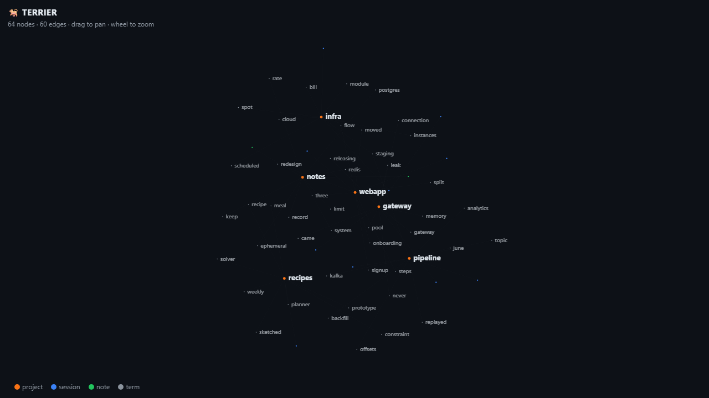

<p align="center">
  <br>
  
  <h1 align="center">Terrier</h1>
</p>

<h3 align="center">Local-first memory for your coding agents.</h3>

<p align="center">
  One SQLite file. Zero dependencies. No cloud, no account, no telemetry.
</p>

<p align="center">
  <a href="https://pypi.org/project/terrier-kb/"></a>
  <a href="https://github.com/Makeph/terrier/actions/workflows/test.yml"></a>
  
  
  <a href="LICENSE"></a>
</p>

---

Every Claude Code session you run leaves a transcript on disk — prompts, decisions, dead ends, fixes. Terrier digs through all of them (plus your markdown notes), indexes everything into a single FTS5 database, and lets you ask questions about your own past work:

```
$ terrier search "memory leak gateway"
┌ 2026-06-14 09:32 · api-gateway · 3f9a2c1d · assistant
│ fix the memory leak in the gateway
└ the [leak] came from the connection pool never releasing … capped it at 50 and added an idle reaper …
```

- *"Have I tried fixing this before? What was attempted?"*
- *"Why did I bump that timeout to 30s? Git history says nothing."*
- *"What did I actually get done this week?"* → `terrier recap`

## Install

```bash
pip install terrier-kb
```

Python ≥ 3.10, standard library only. Works on Windows, macOS, Linux.

## Usage

```bash
terrier ingest                     # index all Claude Code transcripts (incremental)
terrier ingest --notes ~/notes     # also index a markdown folder (remembered)
terrier search "breakout stop loss" -n 5
terrier search "docker" -p myrepo -d 30   # filter by project, last 30 days
terrier recap -d 7                 # digest of the last week, per project
terrier graph --open               # interactive HTML knowledge graph
terrier status                     # what's in the burrow
```

### Auto-ingest

```bash
terrier hook install
```

Adds a `SessionEnd` hook to `~/.claude/settings.json`: every finished session is re-indexed automatically. Your memory stays current without thinking about it. `terrier hook remove` undoes it.

### Knowledge graph

`terrier graph` renders your entire base as a **self-contained HTML file** — projects, sessions, notes, and the shared vocabulary that links them, laid out with a force simulation on a plain `<canvas>`. No CDN, no build step; the file works offline and can be committed, mailed, or dropped in a wiki.

<p align="center">
  
</p>

## How it works

```
~/.claude/projects/**/*.jsonl ─┐
                               ├─► ~/.terrier/terrier.db (SQLite + FTS5)
your markdown folders ─────────┘        │
                                        ├─ terrier search   (BM25, cited snippets)
                                        ├─ terrier recap    (per-project digest)
                                        └─ terrier graph    (HTML force graph)
```

Ingestion is incremental — a file is re-read only when its mtime or size changes. Tool spam, progress events, and injected system reminders are filtered out; only human prompts and assistant prose are indexed. Bodies are capped at 20 kB so a stray file dump can't bloat the index.

## Why not just grep?

You can! Terrier is roughly `grep` with a memory: ranked results (BM25), snippets with highlights, project/date filters, a weekly digest, a graph view, and an auto-updating index — while staying a single file you can delete at any time (`~/.terrier/`).

Inspired by [Stash](https://github.com/Fergana-Labs/stash), which does this as a full multi-agent cloud product. Terrier is the opposite corner of the design space: everything runs on your machine, and `rm -rf ~/.terrier` is a full account deletion.

## License

MIT
